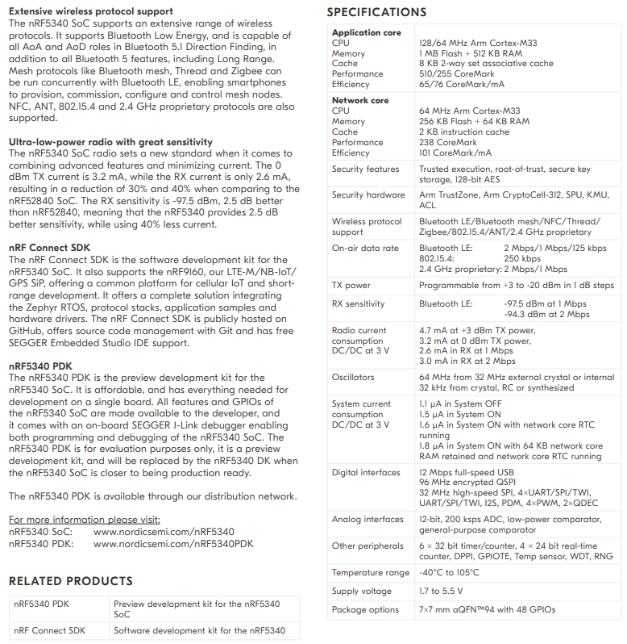

# [nRF5340](https://github.com/SoCXin/nRF5340) 

 

#### [Vendor](https://github.com/SoCXin/Vendor) ：[Nordic](https://github.com/SoCXin/Nordic) 
#### [Core](https://github.com/SoCXin/Cortex) ：[Cortex M33](https://github.com/SoCXin/CM33) 
#### [Level](https://github.com/SoCXin/Level) ：128MHz 

### [nRF5340简介](https://github.com/SoCXin/nRF5340/wiki)

[nRF5340](https://github.com/SoCXin/nRF5340) 是新一代BLE SoC，整合了大量新技术和特性

### [资源收录](https://github.com/SoCXin)

* [文档](docs/)
* [资源](src/)

### [开源项目](https://github.com/SoCXin)

* [官方资源](https://github.com/NordicSemiconductor)

### [选型建议](https://github.com/SoCXin)

[nRF5340](https://github.com/SoCXin/nRF5340)

###  [SoC芯平台](http://SoC.Xin) 

