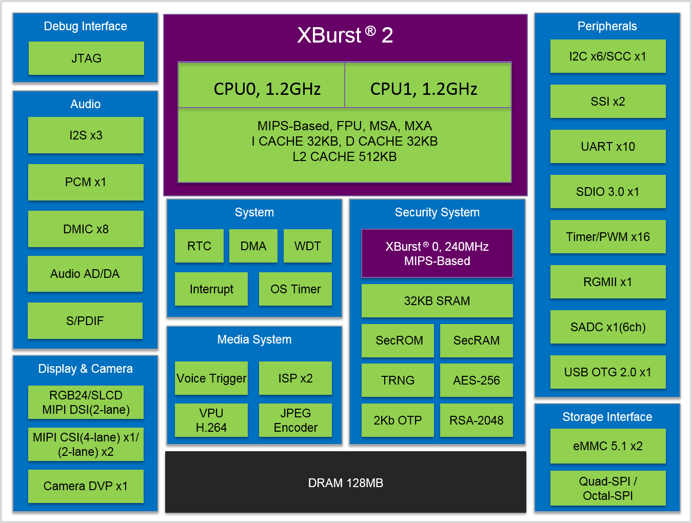

# [X2000](https://doc.soc.xin/X2000)

* [ingenic](http://www.ingenic.com.cn): [MIPS](https://github.com/SoCXin/MIPS)
* [L6R6](https://github.com/SoCXin/Level): 2x 1.2 GHz + 240 MHz

## [简介](https://github.com/SoCXin/X2000)

[X2000](http://www.ingenic.com.cn/?product/id/34.html) 独特的三核结构：双核XBurst 2+XBurst 0结构；主核采用最新一代高性能处理器内核XBurst 2，小核擅长实时控制。XBurst 是北京君正完全自主知识产权的32位RISC CPU内核，兼容MIPS架构。内核包含128-bit SIMD扩展指令、硬件浮点运算单元、内存管理单元。

### 关键参数

* 双XBurst®2核，主频1.2GHz (VS Cortex A53)
* 跨界第三核XBurst®0(240MHz)，面向安全管理和实时控制
* H.264 编、解码器 1080P@30fps
* 内置LPDDR3 128MB
* 双摄Mipi接口+双ISP，可实时同步
* JPEG 编解码器，处理能力70Mega-pixels/s
* 丰富的外设接口 BGA270 12mm x 12 mm x 1.2mm，0.65mm Pitch

#### 图像处理

* ISP处理器x2，支持双摄同步
* CIM控制器x1，支持snapshot
* 单ISP最大处理能力：1080P@120fps（MIPI-CSI 4-lane输入）
* 双ISP同时工作时最大处理能力：1080P@60fps / ISP
* 支持3个摄像头同时接入： MIPI-CSI 2-lane x2 + DVP x1
* 摄像头接口最大分辨率：MIPI-CSI 4-lane，1080P@120fps

#### 音频处理器

* 数字麦克风阵列控制器，支持8通道数字麦克风，语音唤醒
* I2S x3
* PCM 接口、S/PDIF接口

#### 显示器接口

* MIPI-DSI，分辨率可达1920x1080@40Hz
* SLCD，分辨率可达640x480@60Hz，24BPP
* RGB，分辨率可达1280x720@60Hz，24BPP

### [资源收录](https://github.com/SoCXin)

* [参考资源](src/)
* [参考文档](docs/)
* [参考工程](project/)

### [选型建议](https://github.com/SoCXin/X2000)

[X2000](https://github.com/SoCXin/X2000)属于多核异构跨界处理器，芯片典型功耗 <380mW

北京君正成立于2005年，基于创始团队创新的CPU设计技术，迅速在消费电子市场实现SoC芯片产业化，2011年5月公司在深圳创业板上市（300223）

### [www.SoC.xin](http://www.SoC.Xin)
